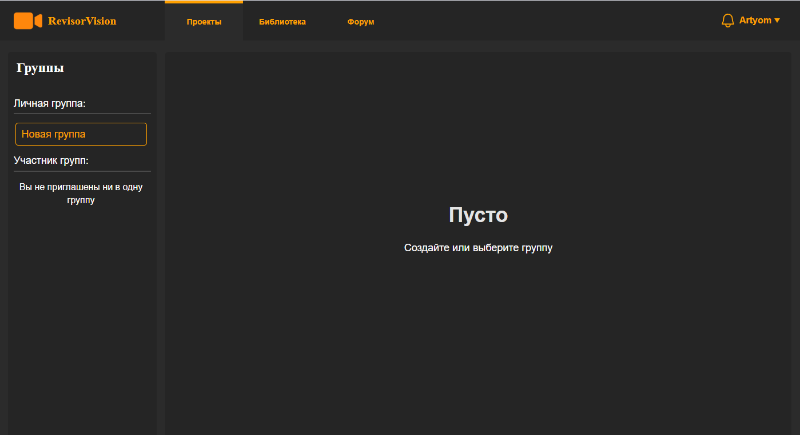
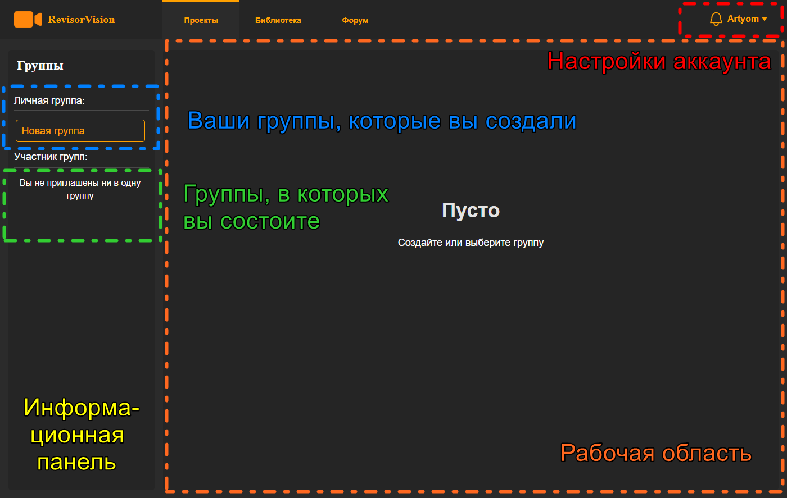
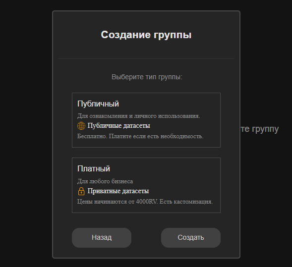

# 1. Создание группы и знакомство с интерфейсом.

<figure><figcaption>
Рисунок  1 - Интерфейс нового пользователя
</figcaption></figure>

Слева будет информационная панель, а большая часть экрана справа – это рабочая область. Первое куда вы попадаете после входа в систему – это информация по группам. Группа – это совокупность проектов, объединённых общим смыслом.&#x20;

Но при этом каждый проект независим, и в группе могут быть разные проекты по своей тематике и назначению. Подробнее по проекту будет ниже.&#x20;

Пользователь может создавать свои группы и быть участником в других группах.

<figure><figcaption>
Рисунок  2 - Описание интерфейса
</figcaption></figure>

Так как у нас нет ещё ни одной группы, создадим её.  Для этого нужно кликнуть на кнопку «Новая группа» (1) как на рисунке 3.  Затем необходимо выбрать категорию группы и ввести её имя (2).

<figure><figcaption>
Рисунок 3 - Создание группы
</figcaption></figure>

После выбрать тип группы: **Публичный** или **Платный**, и нажать кнопку Создать. В публичной группе ваши готовые датасеты будут доступны всем пользователям системы RV. А в платной ваши датасеты будут доступны только вам и участникам группы, и никто больше не будет их видеть.

<figure><figcaption>
Рисунок 4 - Окно выбора типа группы
</figcaption></figure>
