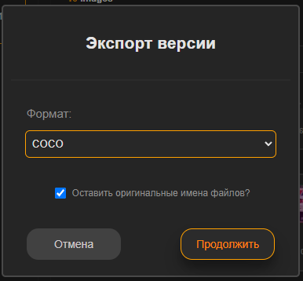
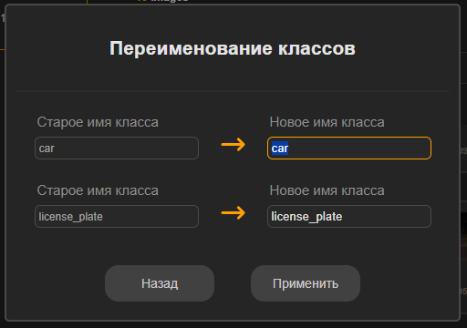
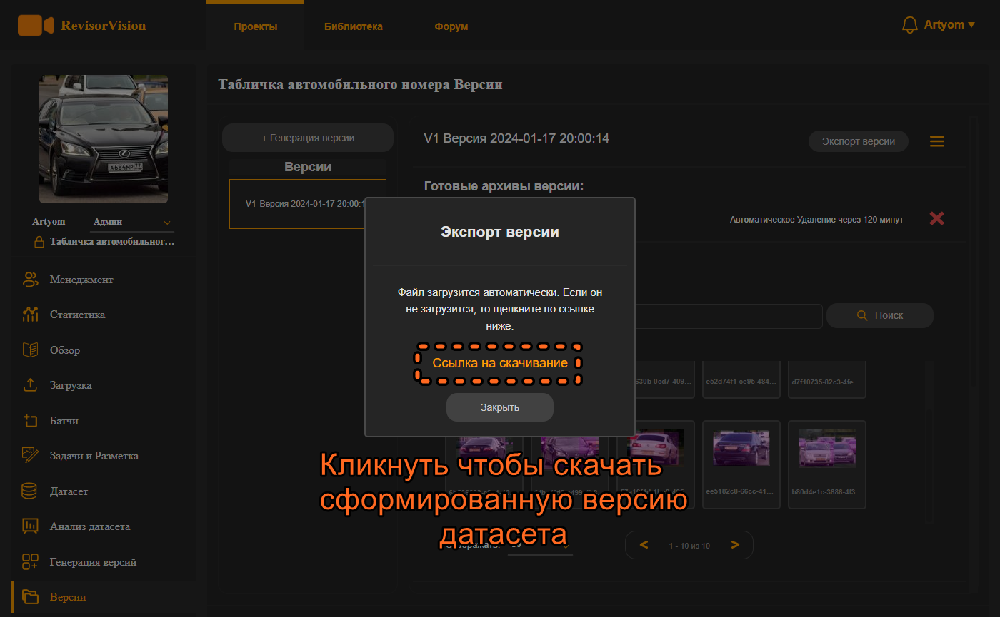

# 10. Экспорт версии датасета.

По окончанию процесса генерации версии датасета нас перебросит на вкладку Версии. Выбираем нужную версию датасета и нажимаем кнопку экспорта версии.

<figure><figcaption>
Рисунок 46 - Интерфейс сгенерированной версии датасета
</figcaption></figure>

В открывшемся меню выбираем формат, в котором сохранить разметку по изображениям.

<figure><figcaption>
Рисунок 47 - Формат экспорта версии датасета
</figcaption></figure>

Если нужно меняем названия классов. И нажимаем применить.&#x20;

<figure><figcaption>
Рисунок 47 - Переименование классов при Экспорте версии датасета
</figcaption></figure>

После генерации архива версии датасета, появляется всплывающее окно со ссылкой на архив со сформированным датасетом. Кликаем на ссылку чтобы скачать.\
Созданный архив Экспорта будет храниться в интерфейсе версии. Архив так-же можно скачать, кликнув по его названию. Если архив не был скачан, то он будет храниться 24 часа. Скачанный же архив, будет храниться 2 часа.

<figure><figcaption>
Рисунок 48 - Ссылка на скачивание Архива версии датасета
</figcaption></figure>

Поздравляем! Вы только что разметили свой первый датасет в нашей системе. Надеемся что наш сервис был понятен и удобен, и вы получили удовольствие от процесса и результата. Следите за нашими обновлениями. Мы не прекращаем работу над улучшением нашего сервиса и будем рады вашим пожеланиям и замечаниям, которые можно оставить на форуме или же написать нам письмо в техподдержку.
