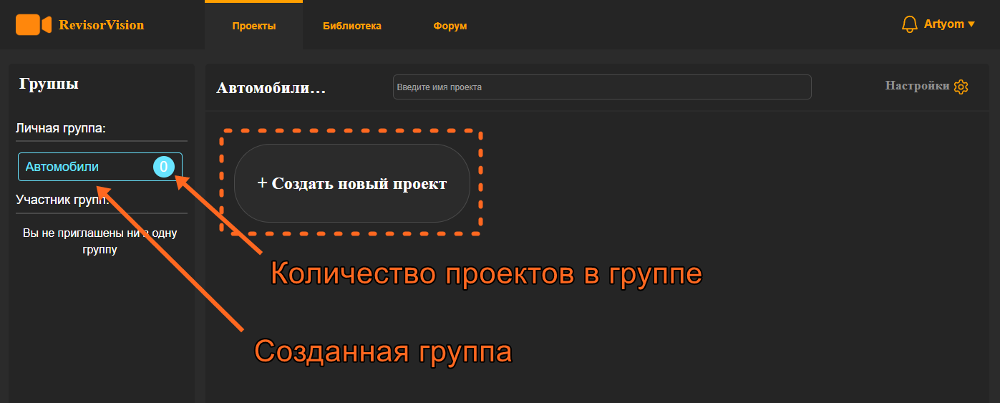
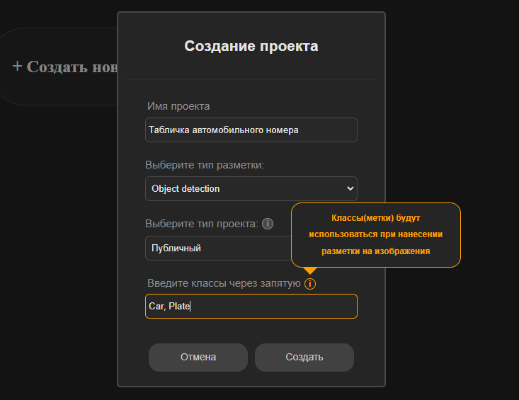
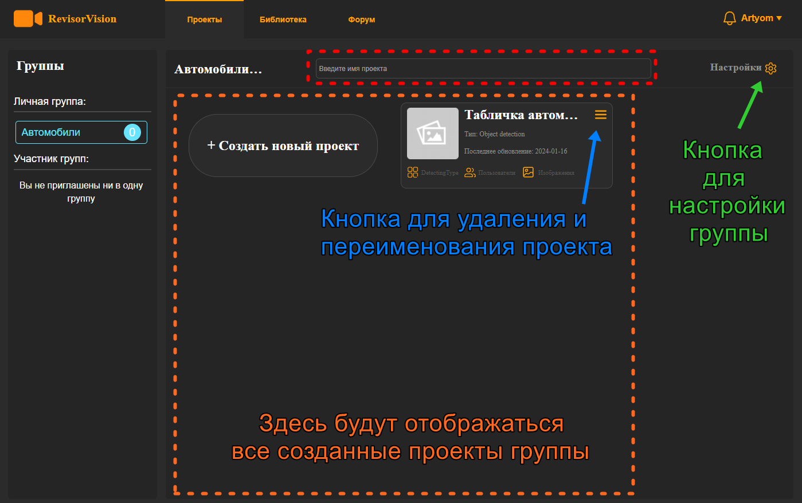

# 2. Создание проекта.

<figure><figcaption>
Рисунок 5 - Пустая группа
</figcaption></figure>

Создадим проект. Для этого нужно кликнуть на кнопку **+ Создать новый проект**.&#x20;

В открывшемся окне нужно ввести **имя проекта**, выбрать **тип разметки**, **тип проекта** и перечислить **через запятую** названия **классов**, которые вы будете использовать при разметке изображений в этом проекте. Также обратите внимание что возле некоторых полей есть значок с подсказками (i).

<figure><figcaption>
Рисунок 6 - Создание проекта
</figcaption></figure>

Все созданные проекты будут отображаться в рабочей области. Здесь можно их выбирать, удалять, переименовывать. Чтобы выбрать проект просто кликните на его поле. А чтобы переименовать или удалить нажмите на кнопку в правом верхнем углу поля проекта как на изображении ниже. Пока в проекте нет изображений и иконка проекта пустая. После загрузки изображений иконка автоматически установиться. Чтобы перейти к настройкам группы справа сверху есть “шестерёнка“. Также для удобства, когда много проектов, сверху есть поле для быстрого поиска.

<figure><figcaption>
<code>Рисунок 7 - Интерфейс группы с созданным проектом</code>
</figcaption></figure>

