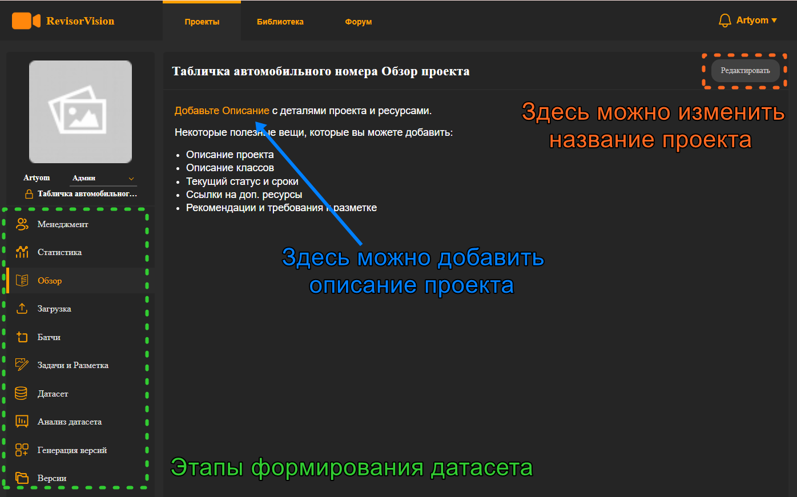
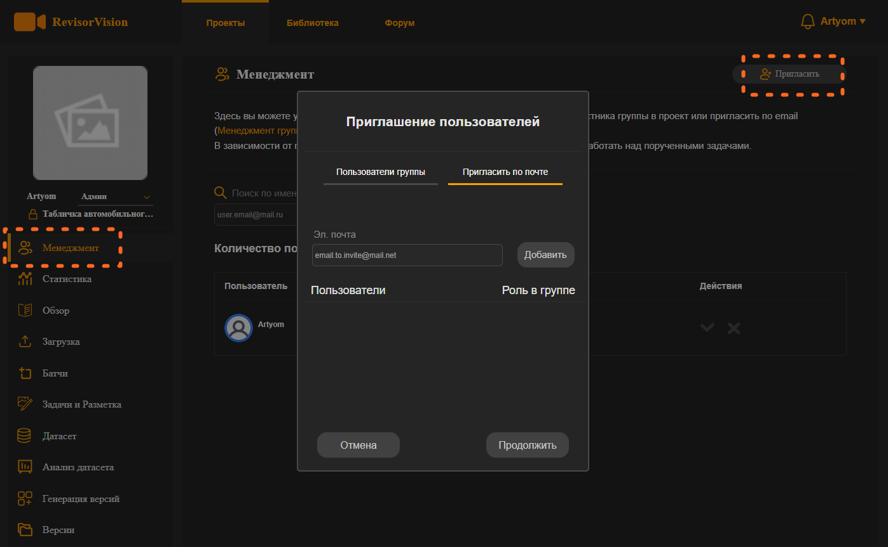

# 3. Интерфейс разработки проекта.

Зайдём внутрь проекта, для этого кликнем на карточку проекта. Нам откроется инструментарий по работе с проектом.&#x20;

Как и любой проект в другой сфере он делится на этапы. В нашем случае изображения должны пройти по условному “конвейеру” до готового датасета по этапам:&#x20;

1. Загрузка изображений,&#x20;
2. Создание задач на разметку,&#x20;
3. Разметка изображений,&#x20;
4. Добавление изображений в датасет,&#x20;
5. Подготовка версии датасета, препроцессинг и аугментация (увеличения количества и разнообразия изображений),
6. Экспорт готовой версии датасета.&#x20;

Все эти этапы можно увидеть слева на информационной панели (рисунок 8).

<figure><figcaption>
Рисунок 8 - Интерфейс проекта
</figcaption></figure>

При открытии проекта мы попадаем на вкладку Обзор проекта. Здесь можно редактировать название проекта, добавить его описание.&#x20;

Также выше  вкладки Обзор есть вкладки **Статистики** и **Менеджмента**. Платформа ориентирован как на работу в команде, так и одного пользователя. Во вкладке **Менеджмента** можно приглашать участников группы в проект или отправить приглашения пользователям на почту, назначать им роли **Внутри проекта**. Во вкладке статистики можно будет посмотреть текущий прогресс по разметке и модерации размеченных изображений.

\

<figure><figcaption>
Рисунок 9 - Менеджмент
</figcaption></figure>

Отлично! У нас есть созданная группа и проект. Теперь погрузимся в роли группы и проекта.
