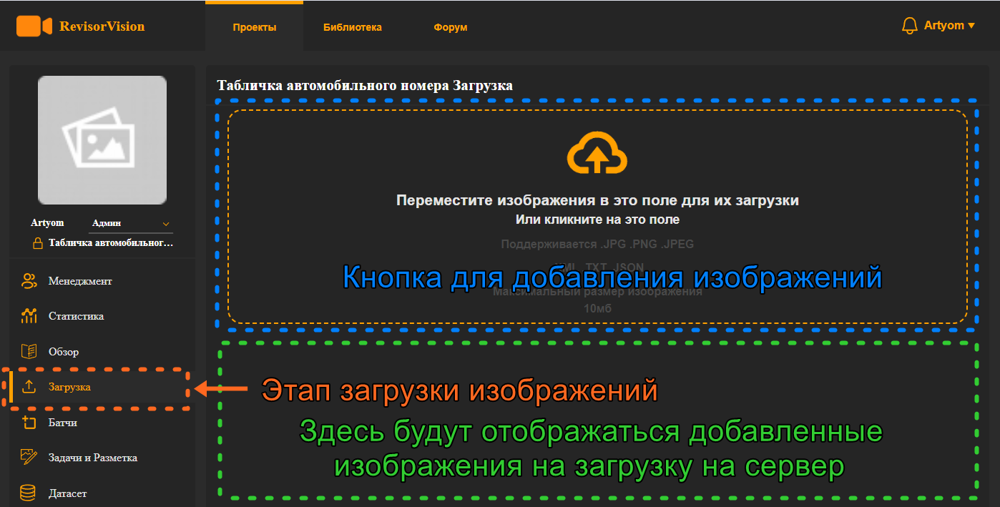
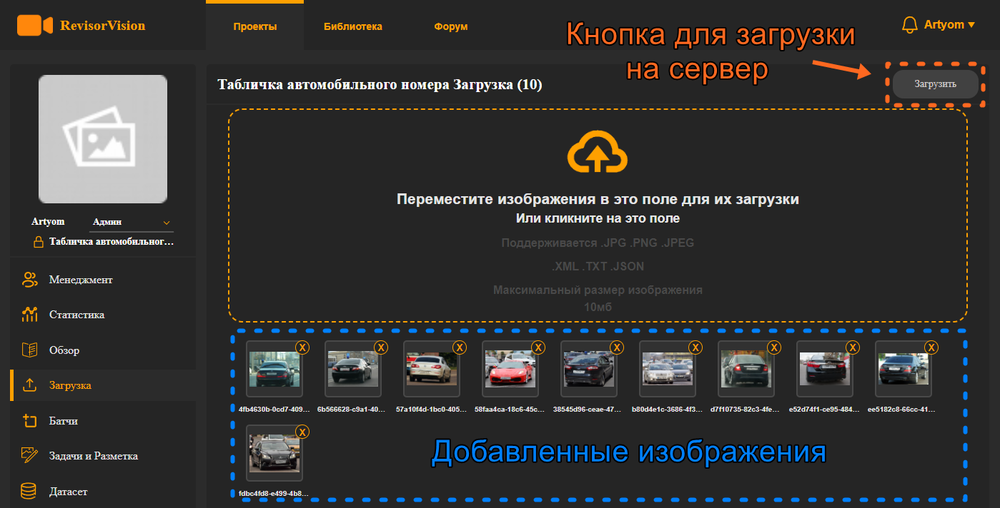
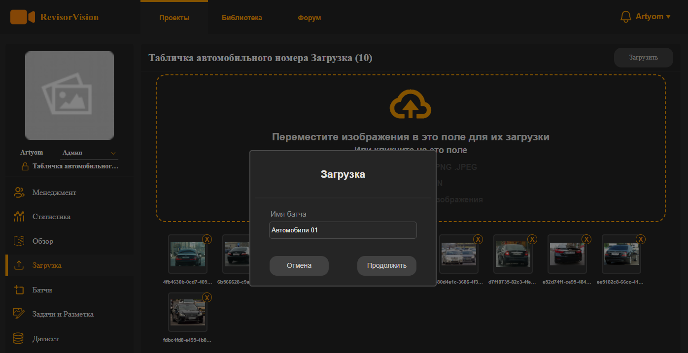

# 5. Загрузка изображений.

На информационной панели, расположенной слева, кликаем на этап загрузки изображений. В рабочей области есть большая область для добавления изображений. \
Если на неё кликнуть, то откроется файловый менеджер операционной системы. \
Необходимо выделить изображения и добавить их. Так же можно заранее у себя на компьютере выделить необходимые файлы и перетащить их в это поле, и они автоматически добавятся т.к. форма загрузки поддерживает Drag\&Drop.

<figure><figcaption>
Рисунок 10 - Интерфейс загрузки изображений
</figcaption></figure>

Пока мы только добавляем изображения на загрузку, но ещё не загружаем. Добавлять можно, как только изображения, так и изображения вместе с метками. Наша система знакома со всем распространёнными форматами разметки датасетов и автоматически распознает разметку, и отобразит её. Система проверит добавленные файлы и отобразит их в нижней части рабочей области. Файлы можно убрать из добавленных кликнув на крестик на иконке изображения.

<figure><figcaption>
Рисунок 11 - Загрузка изображений
</figcaption></figure>

Откроется окно, в котором нужно просто ввести имя пакета (батча) изображений и нажать продолжить. Изображения в системе загружаются пакетами. На основе этих совокупностей изображений будут создаваться задачи.

<figure><figcaption>
Рисунок 12 - Загрузка и создание батча
</figcaption></figure>

