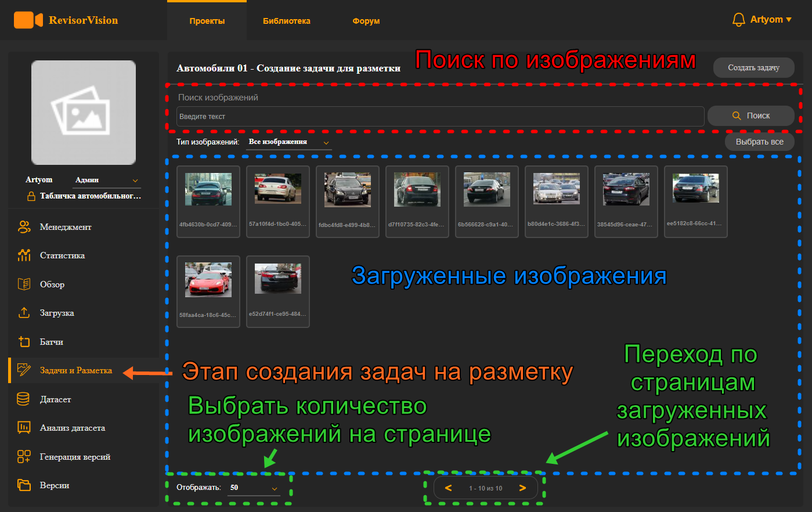
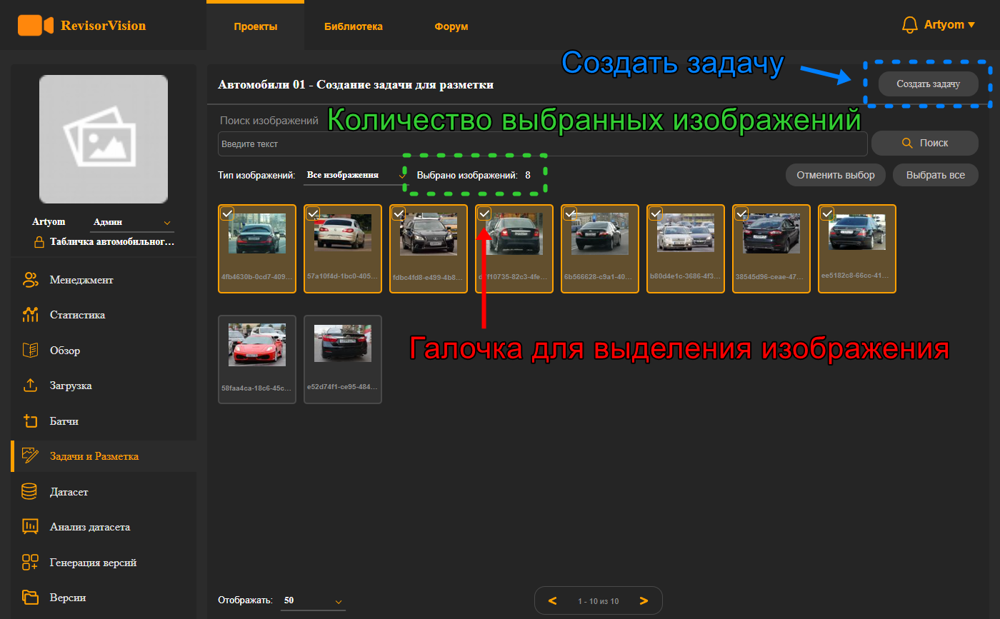
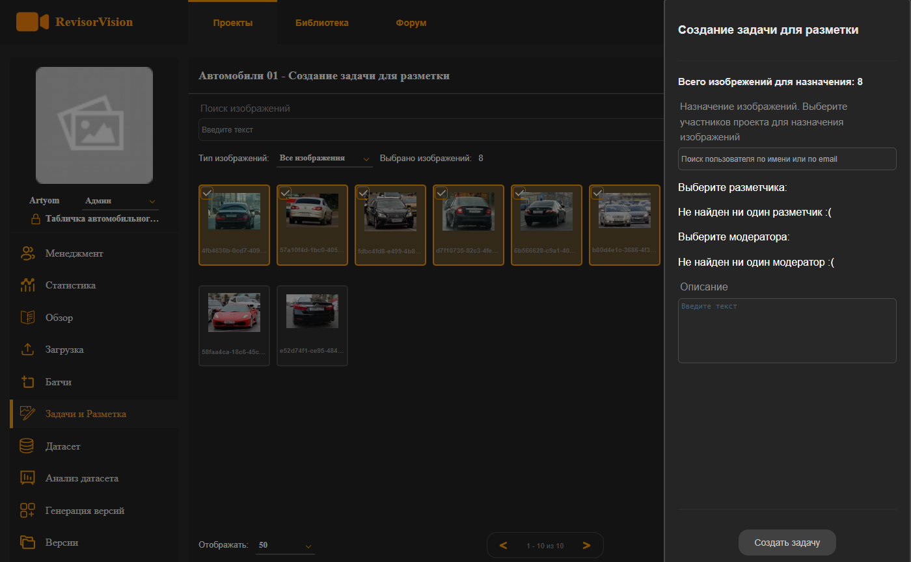

# 6. Создание задач на разметку изображений.

После загрузки изображений нас перебрасывает на этап создания задач на разметку. Все загруженные изображения будут отображаться в рабочей области. Количество изображений на страницу можно выбрать снизу слева рабочей области. А внизу рабочей области можно кликать для перемещения по страницам. Также в системе есть поиск по изображениям.

<figure><figcaption>
Рисунок 13 - Интерфейс батча
</figcaption></figure>

Чтобы посмотреть изображение нужно кликнуть на иконку изображения. Изображение отобразиться в большем размере. Чтобы вернуться ко всем, просто кликните в свободную область вне изображения.

Теперь нам нужно выбрать изображения, которые будут в задаче разметки. \
Для этого можно воспользоваться кнопкой “**Выбрать все**” справа сверху на рабочей области. Все изображения будут выделены. Обратите **внимание** что выделяться только все изображения **текущей** страницы. Изображения можно выделять на любой странице. Если вы хотите отобразить большее кол-во изображений в текущей странице, вам достаточно сделать выбор, кликнув в области "отображать". \
Далее можно снять или добавить выделение конкретных изображений. Для этого нужно навести курсор мышки на нужное изображение, оно будет подсвеченным и слева сверху на иконке изображения будет значок “галочки”, кликая на неё, можно выделить или снять выделение  необходимых изображений.

<figure><figcaption>
Рисунок 14 - Выделенные изображения
</figcaption></figure>

Выделив необходимые изображения, нажимаем на кнопку создания задачи. Нам откроется вкладка для создания задачи. Там мы можем выбрать кому назначить эту задачу и добавить её описание. И нажимаем создать задачу.

<figure><figcaption>
Рисунок 15 - Создание задачи разметки
</figcaption></figure>

Можно не выбирать конкретного исполнителя для задачи. Тогда задача будет в общем пуле и любой исполнитель(разметчик и модератор) сможет её взять в работу.
