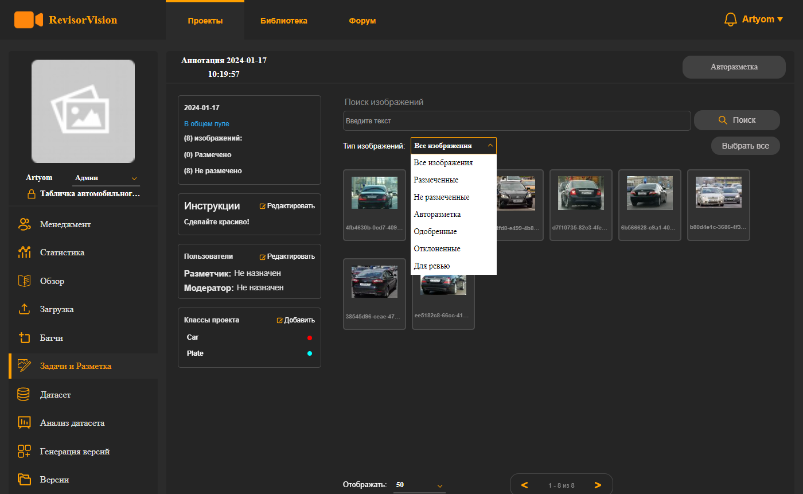
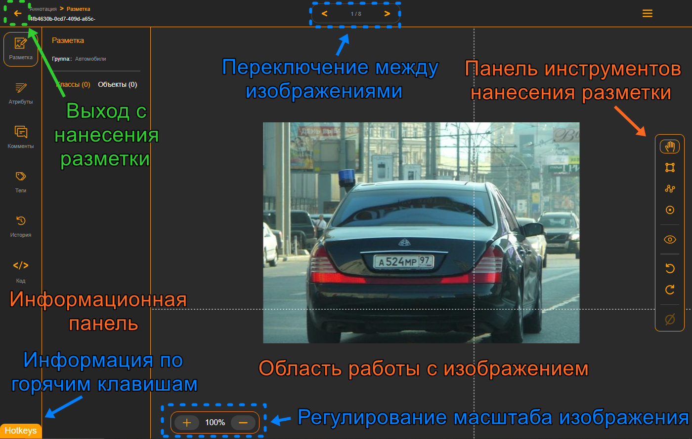
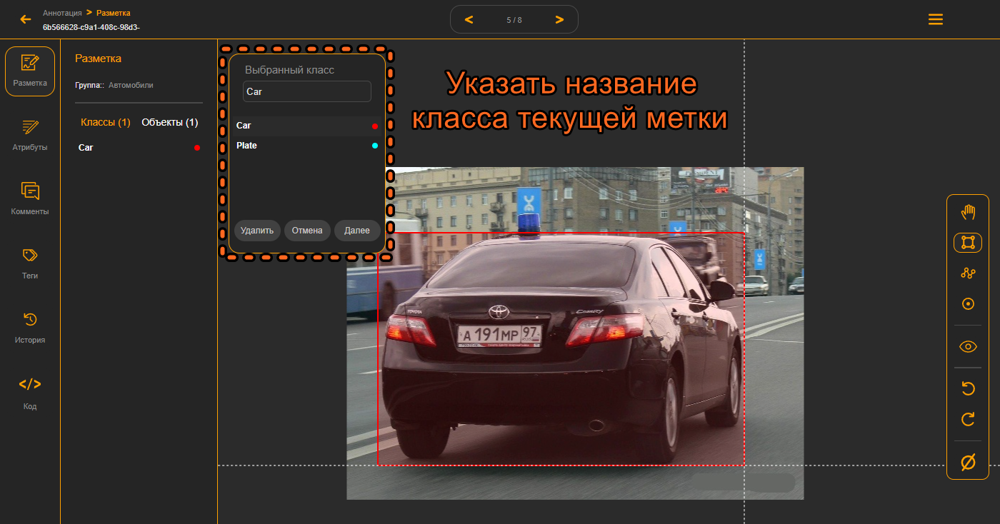
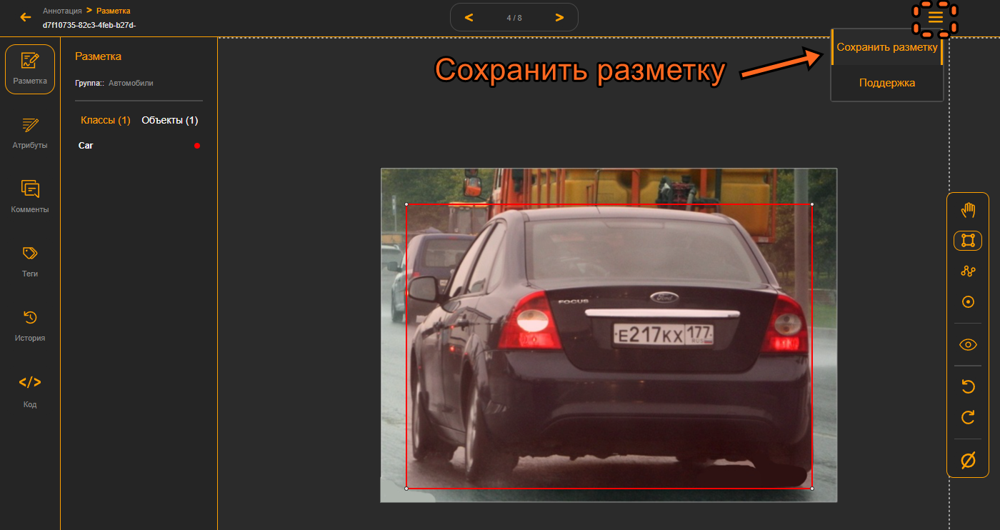

# 7. Разметка изображений.

После создания задачи, нас перебрасывает на её страницу.\
Здесь мы видим информацию по задаче и можем её дополнить. \
Мы можем Добавить инструкцию, классы объектов для разметки. Можно выбрать тип изображений, с которыми сейчас будем работать. Также есть поиск по изображениям и переход по страницам. Ещё вверху вы можете увидеть кнопку "авторазметка". На ней мы подробнее остановимся позже.\

<figure><figcaption>
Рисунок 16 - Интерфейс созданной задачи
</figcaption></figure>

Чтобы перейти к самой разметке нужно кликнуть на определённое изображение, и мы перейдём в инструмент нанесения разметки. Если у вас в пакете помимо изображений были ещё файлы разметки, то здесь вы увидите уже нарисованную разметку, которую можно будет удалить или редактировать.

Слева расположена информационную панель, посередине область для работы с изображением, а справа панель инструментов для нанесения и взаимодействия с разметкой. Сверху есть стрелочки переключения между изображениями. Снизу регулировка масштаба изображения. Также слева снизу есть информация по **горячим клавишам** использования инструментов&#x20;

<figure><figcaption>
Рисунок 17 - Интерфейс инструмента разметки
</figcaption></figure>

Остановимся подробнее на панели инструментов. Идём сверху вниз. \
С помощью **первого инструмента** можно выбирать конкретный элемент разметки, если навести на него курсор и кликнуть. Или же перемещаться по полю нанечения разметки. \
**Второй** – инструмент рисования прямоугольной рамки объекта.\
**Следующий** – инструмент нанесения полигона. \
**Четвёртый** инструмент предназначен для нанесения ключевых точек объекта. \
После расположена иконка перехода к **авторазметке**, значки возвращения **назад** по истории действий или **вперёд** и **полное очищение** всего изображения от разметки. Отдельные элементы можно удалить путём **выделения** и последующего нажимания кнопки **delete** на клавиатуре.

<figure><figcaption>
Рисунок 18 - Интерфейс инструмента разметки
</figcaption></figure>

Выберем инструмент рисования прямоугольника и выделим контур автомобиля. Чтобы начать рисовать прямоугольник выведем курсор в какой-то угол будущего прямоугольника. Для удобства от курсора в разные стороны в виде плюса отходят линии, на которые можно ориентироваться. Нажмём левую кнопку мыши и не отпуская её протянем прямоугольник в противоположный угол и в этот момент отпустим кнопку. У нас появится окно выбора имени класса текущей метки. Нужно кликнуть на нужное название и нажать далее. Либо отмена или удалить (если нужно).

<figure><figcaption>
Рисунок 19 - Инструмент "Прямоугольник"
</figcaption></figure>

Таким же способом разметим табличку автомобильного номера. После добавления метка появится слева в информационной панели. Во вкладке классы наведя курсор на нужный класс можно подсветить на изображении все метки с выбранным классом. Во вкладке объекты можно подсветить конкретный выбранный объект.

<figure><figcaption>
Рисунок 20 - Информационная панель с классами и объектами
</figcaption></figure>

Если нужно отредактировать положение рамки объекта нужно активировать инструмент выбора. При наведении курсора на нужную рамку курсор изменит свой вид и зажав левую кнопку мыши можно перетащить рамку в нужное положение. Также если навести курсор на угол прямоугольника и зажав кнопку мыши можно изменить его положение.

Обратите внимание что при переключении на следующее или предыдущее изображение происходит автоматическое сохранение разметки изображения. Однако если вы нанесли разметку и не перейдя на другое изображение и вышли с интерфейса разметки изображений, то разметка по этому изображению автоматически не сохранится. Чтобы она сохранилась, нужно нажать сохранить в кнопке дополнительных действий справа сверху. Но всё же удобнее переходить от изображения к изображению с автоматическим сохранением.

<figure><figcaption>
Рисунок 21 - Сохранение разметки.
</figcaption></figure>

Разметим все остальные изображения чтобы перейти к созданию датасета.
