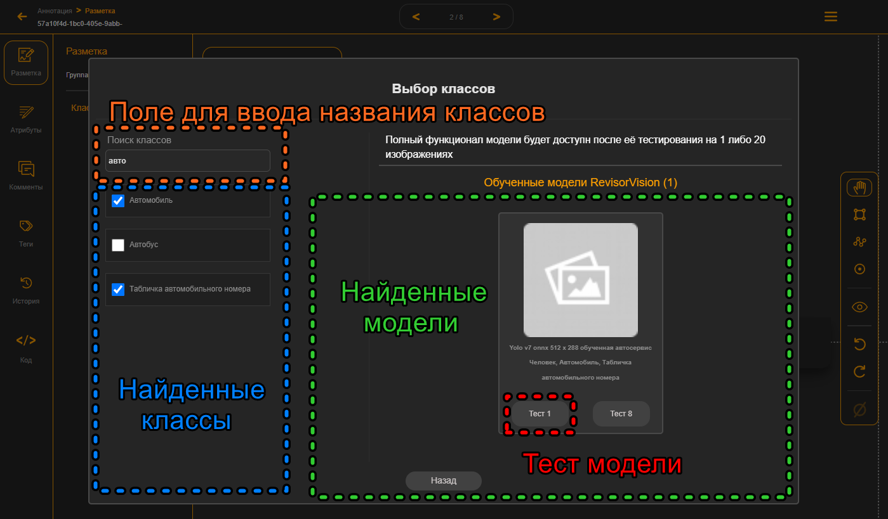
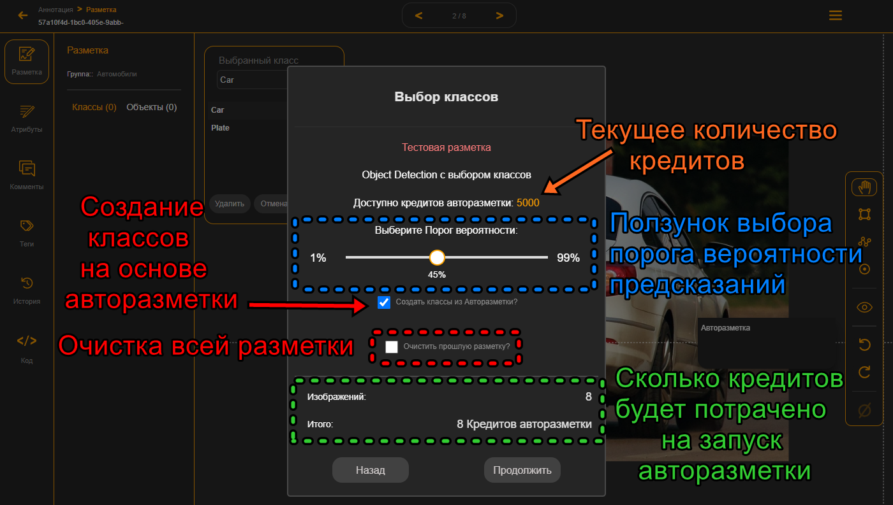
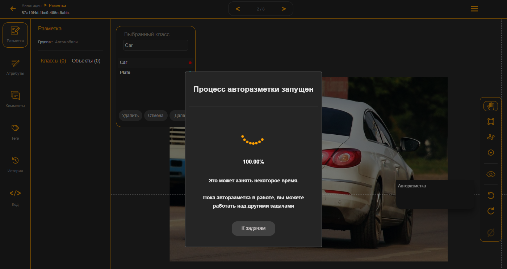
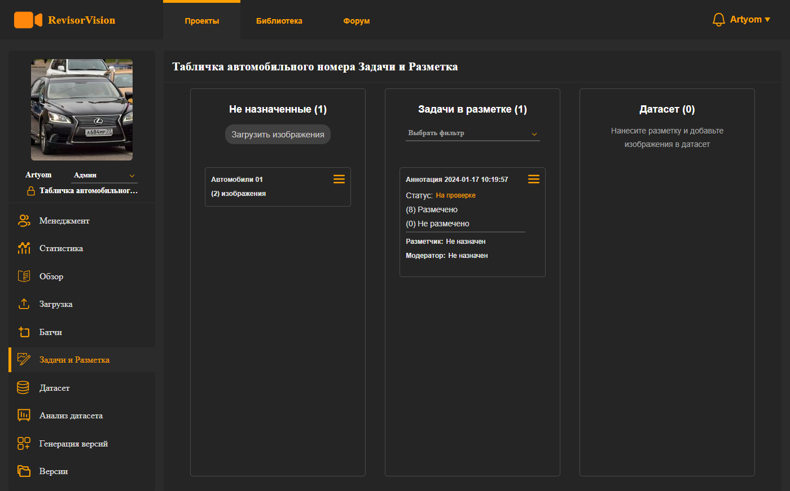
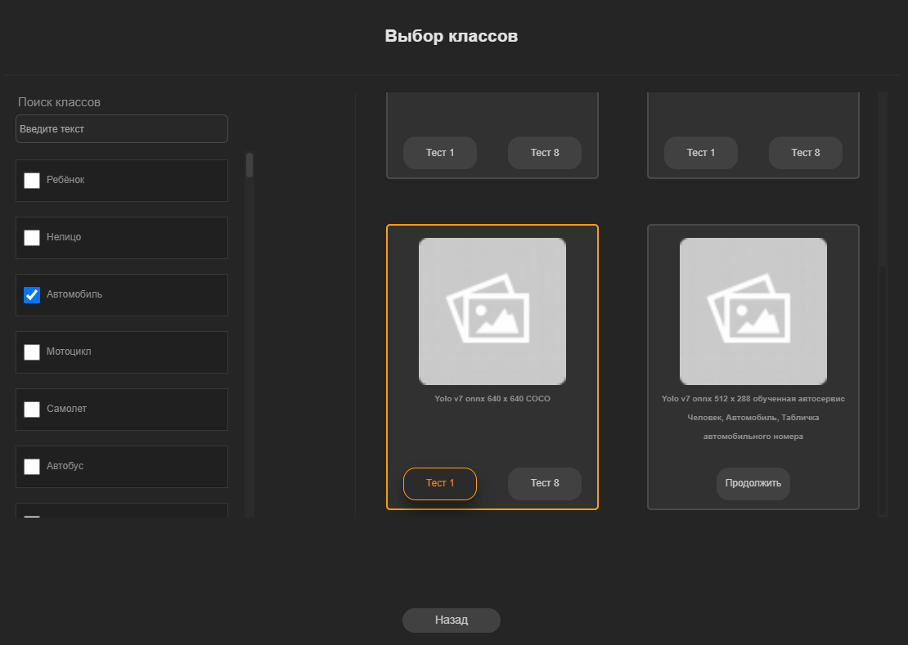
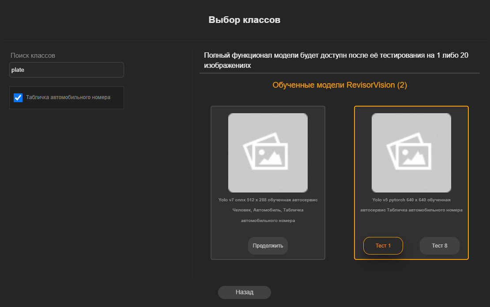
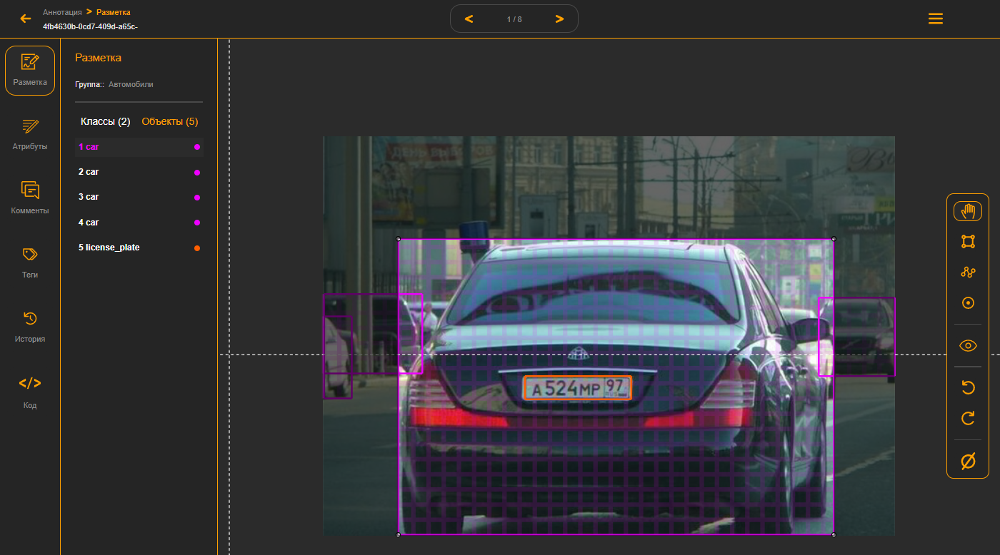
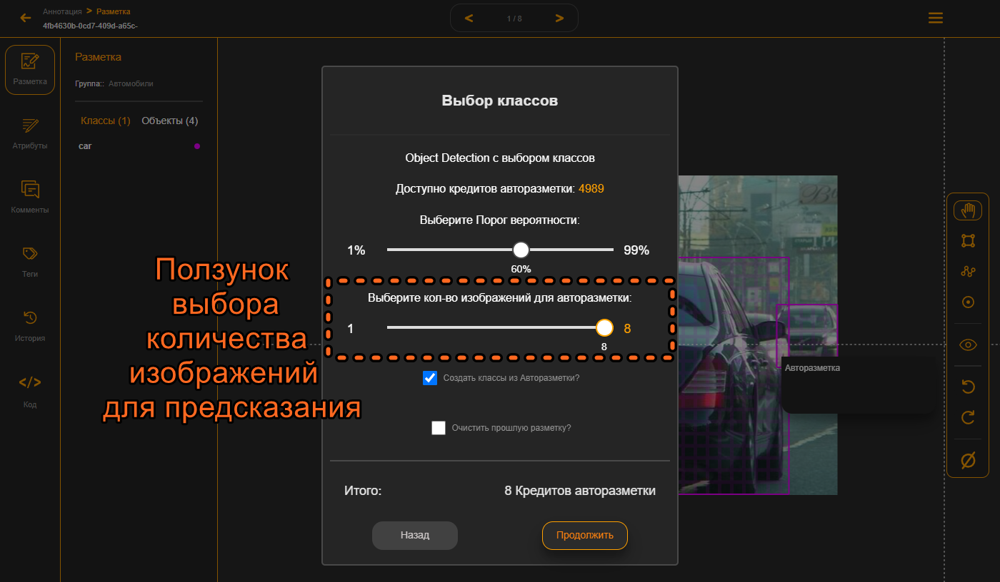
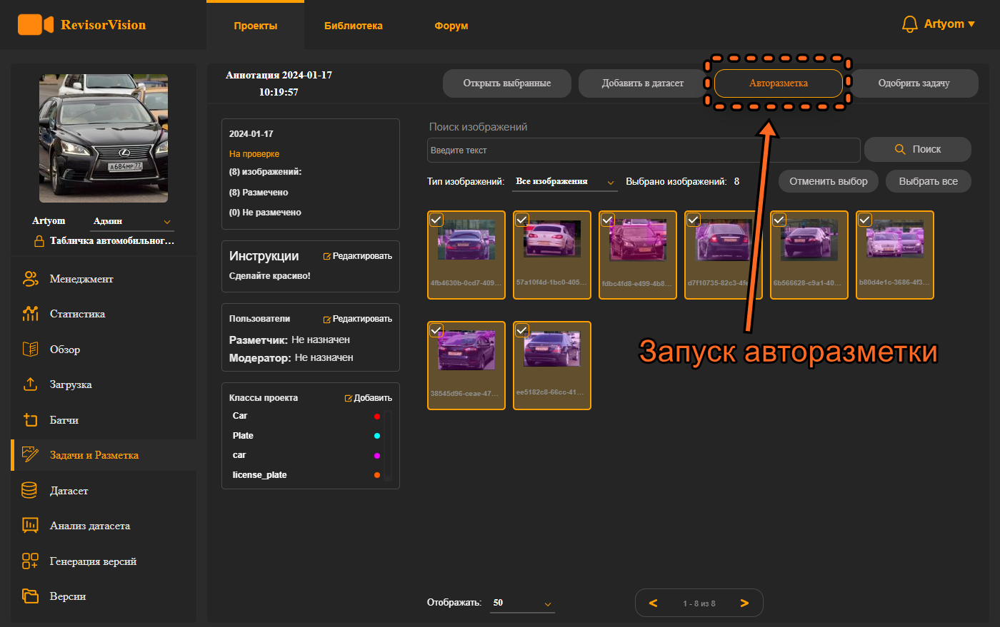

# 8.1. Выбор классов.

<figure><figcaption>
Рисунок 22 - Окно выбора AI инструмента Авторазметки
</figcaption></figure>

Кликаем на выбор классов. Нам откроется окно поиска классов и моделей. В строке поиска поочерёдно вводим нужные классы. И в результатах поиска отмечаем нужные классы галочками. На основе выбранных классов будут найдены модели, которые могут предсказать все выбранные классы. Если же вы область с моделями пустая, попробуйте выбирать по одному классу и тестировать предложенные модели.

Если вы ещё не использовали конкретную модель наш сервис предложит вам протестировать модель на каком-то небольшом количестве изображений: на одном или не больше 20. На основе этого теста вы сможете оценить насколько подходит или нет вам данная модель и решить использовать ли её в дальнейшем. Мы постоянно обновляем и добавляем новые модели в зоопарк доступных моделей авторазметки.

В поиске можно вводить названия не полностью и смотреть какие классы найдёт система. Нам нужно обнаружение автомобиля и таблички автомобильного номера. На данный момент пока есть только одна модель сразу со всеми необходимыми классами. Выберем её для теста на одном изображении. Эта модель помимо автомобиля и таблички номера ещё может находить человека. Но так как мы не указали галочкой класс человек, по этому классу не будут отображаться метки, будут только по выбранным.

\

<figure><figcaption>
Рисунок 23 - Интерфейс AI инструмента выбора классов
</figcaption></figure>

После у нас откроется окно запуска авторазметки. На нём мы можем увидеть сколько кредитов сейчас вам доступно и сколько будет стоит запустить авторазметку. Есть ползунок для задания порога вероятности предсказаний. Все найденные объекты с меньшей вероятностью чем указана будут проигнорированы и не будут отображаться. Если поставить флаг очистки разметки, то вся разметка, которая была нанесена авторазметкой будет очищена. Но метки, нанесённые вами, не будут удалены. Это флаг поможет в тестах моделей авторазметки. В начале вы тестируете модели, потом очищаете разметку и запускаете уже нужную модель на всём пакете изображений. С помощью флага создания классов из авторазметки можно будет получить метки классов, если в проекте и авторазметке названия классов отличаются.

<figure><figcaption>
Рисунок 24 - запуск AI инструмента авторазметки
</figcaption></figure>

После всех настроек нажимаем продолжить и запускается окно прогресса выполнения авторазметки. В зависимости от количества изображений сложности модели и загруженности самого сервера авторазметка может занимать какое-то время.

<figure><figcaption>
Рисунок 25 - Прогресс нанесение разметки AI инструментом
</figcaption></figure>

На время выполнения задачи авторазметки эта задача блокируется до полного выполнения. Но можно вернутся к другим задачам. Для этого на окне прогресса нужно нажать кнопку “к задачам”. Вам отобразится вкладка с тремя вертикальными колонками. В первой слева будет отображена информация по неиспользованным изображениям в задачах. В колонке посередине – задачи в разметке с их статусом. А в левой – информация по изображениям добавленным в датасет.

<figure><figcaption>
Рисунок 26 - Интерфейс батчей и задач
</figcaption></figure>

Бывают ситуации, когда нет модели, в которой есть все необходимые классы или модель плохо справляется с поиском конкретных классов. Тогда стоит искать модели по одному классу и последовательно пройти по всем необходимым классам.

К примеру, нам нужно детектировать автомобили и их таблички номера. Для этого вначале введём в поиске автомобиль и выберем галочкой только один класс. Выберем подходящую модель и запустим авторазметку только по классу автомобиль.

<figure><figcaption>
Рисунок 27 - Выбор моделей инструмента AI разметки
</figcaption></figure>

Посмотрим качество предсказаний, попробуем другие модели по классу автомобиль. После уже введём в поиске класс таблички автомобильного номера. Обратите внимание что в поиске можно вводить английские названия классов.

<figure><figcaption>
Рисунок 28 - Выбор моделей инструмента AI разметки
</figcaption></figure>

Протестируем модели для класса таблички номера. Посмотрим предсказания.

<figure><figcaption>
Рисунок 29 - Результат разметки AI инструментом
</figcaption></figure>

Всё детектирует как нужно, запоминаем наилучшие модели по классам. Теперь можно запустить разметку по всему датасету с наилучшими моделями. Можно активировать флаг очищения предыдущей разметки. После того как вы протестировали модель на небольшом количестве изображений появится ползунок выбора количества изображений для предсказания. Выбираем нужное количество изображений с помощью ползунка и запускаем.

<figure><figcaption>
Рисунок 30 - Выбор количества изображений к нанесению разметки AI инструментом.
</figcaption></figure>

Также есть альтернативный вариант запуска авторазметки по конкретным выбранным изображениям. Для этого, не заходя в инструмент нанесения разметки, в задачах можно выделить нужные изображения и нажать кнопку авторазметки.

<figure><figcaption>
Рисунок 31 - Авторазметка из интерфейса задачи
</figcaption></figure>

