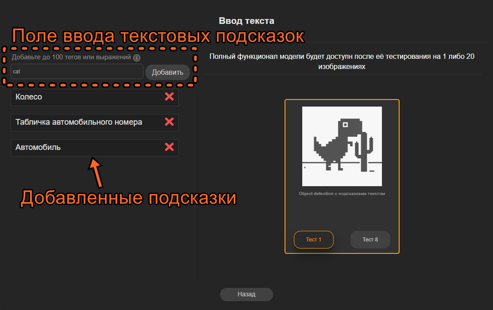
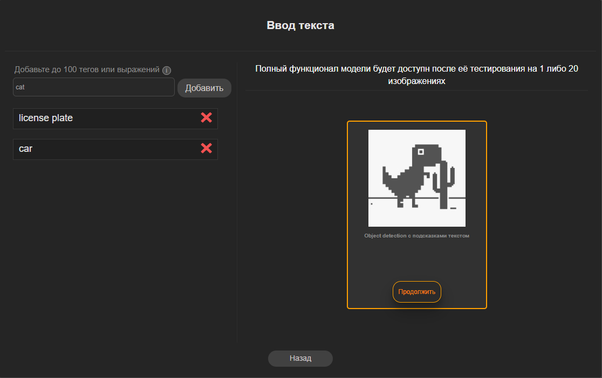
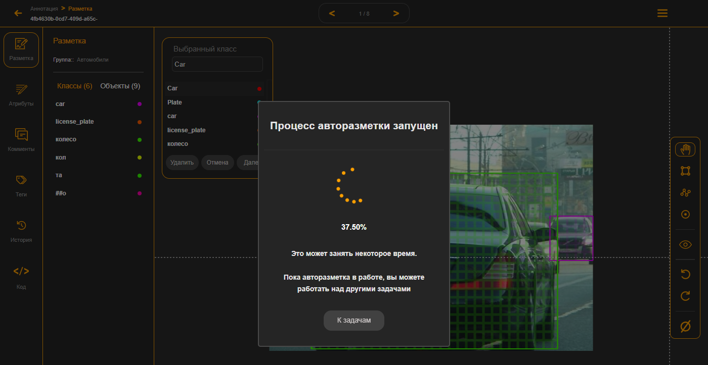

# 8.2. Авторазметка с помощью текстовых подсказок.

<figure><figcaption>
Рисунок 22 - Окно выбора AI инструмента Авторазметки
</figcaption></figure>

Теперь протестируем авторазметку с помощью текстовых подсказок. Здесь используется языковая модель, которая в каком-то приближении может понимать человеческий язык. И ей можно “человеческим” языком объяснить, что нужно искать на изображении. Можно перечислить просто названия объектов или же добавить описание. Здесь именно не названия классов, а текстовые подсказки. Например, нужно искать не просто автомобили, а только все синие автомобили или же не просто человека, а человека, сидящего на стуле, или же самый правый автомобиль на изображении. Конечно, модель не всегда может выдавать подходящий результат, но её потенциал очень огромен. Особенно когда у вас вообще нет никакой разметки и нужны первые экземпляры для обучения модели. Здесь нужно экспериментировать с формулировкой подсказок. У неё другой принцип работы нежели у классических моделей. Она может найти на изображениях те объекты, которых раньше вообще не видела, ей не нужно предобучение как по классам.

<figure><figcaption>
Рисунок 32 -  AI инструмент разметки с вводом текстовых подсказок
</figcaption></figure>

Чтобы передать подсказки модели введите текст подсказки с описанием по одному объекту за раз и нажмите добавить. Добавляйте подсказки последовательно по всем нужным объектам. Вы можете вводить подсказки как на русском, так и на английском языках.

<figure><figcaption>
Рисунок 33 - Ввод подсказок
</figcaption></figure>

Обратите внимание что процесс разметки с помощью этой модели будет дольше, модель более ресурсоёмкая. Какие-либо ненужные объекты или огрехи в разметке можно будет удалить или подправить в инструменте нанесения разметки.

<figure><figcaption>
Рисунок 34 - Прогресс нанесения разметки AI инструментом
</figcaption></figure>

