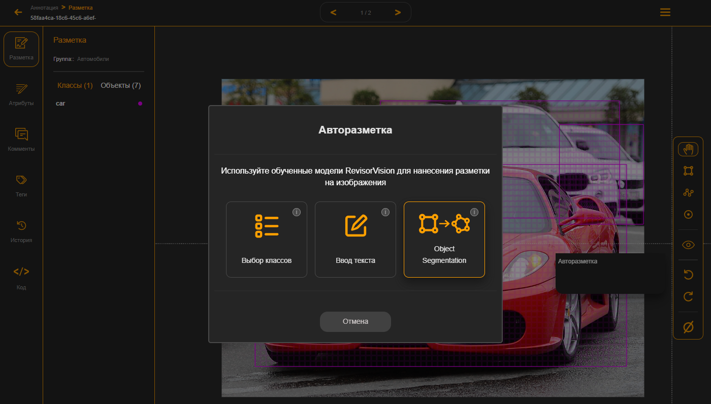
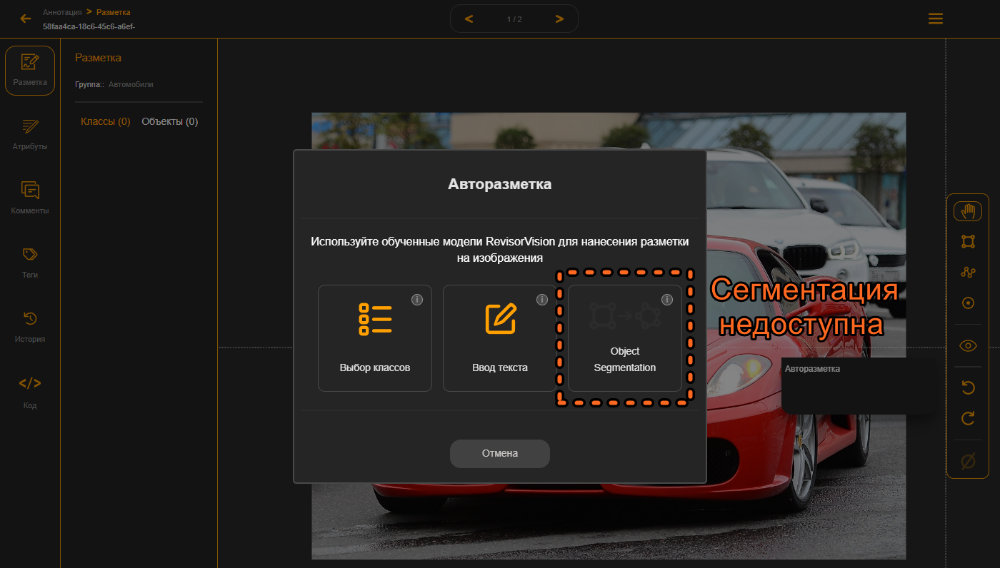

# 8.3. Сегментация объектов в рамках.

Третий тип авторазметки – это сегментация объектов. Она позволяет выделить контур объектов более точно с помощью полигонов. Вручную делать сегментацию довольно долго и затратно. Здесь же вы можете с помощью первых двух типов разметки выделить прямоугольными рамками нужные объекты. А дальше модель возьмёт каждый объект внутри рамки и сегментирует его полигоном.

<figure><figcaption>
Рисунок 35 - Выбор AI инструмента сегментации
</figcaption></figure>

Обратите внимание что если на изображении нет прямоугольных рамок, то модель не сможет взять в работу изображение и инструмент сегментации будет недоступен. Но только пока не появятся рамки объектов.

<figure><figcaption>
Рисунок 36 - Сегментация недоступна без рамок
</figcaption></figure>

