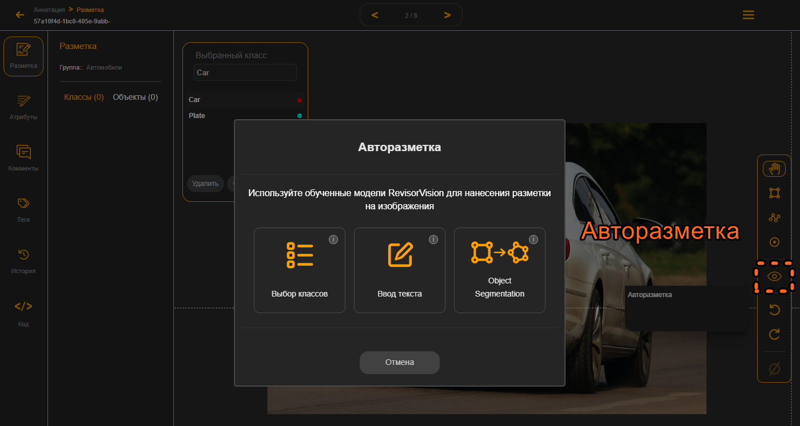

# 8. Авторазметка, AI инструменты разметки

Можно размечать изображения вручную. Но это затратно по времени и очень нудно. Для облегчения разметки можно воспользоваться инструментом автоматической разметки. Для большинства классов есть уже готовые модели, которые разметят нужные классы вместо вас. Если же у вас специфическая задача и нет для выбора нужных классов или же существующие модели плохо находят нужные объекты придётся какое-то количество изображений всё же разметить вручную. Далее на небольшом количестве изображений с помощью аугментации расширить датасет и обучить начальную модель. Эту модель можно будет загрузить на сервис и дальше её использовать для разметки постепенно дообучая модель, и всё больше улучшая качество авторазметки.

Авторазметка происходит за счёт вычислительных ресурсов наших серверов. Она значительно ускоряет и облегчает разметку датасета, но за скорость и удобство нужно платить. На старте пользователю бесплатно даётся определённое количество кредитов, которые он может потратить на авторазметку либо другие дополнительные возможности.

Чтобы перейти к авторазметке вы можете до выхода в инструмент разметки выбрать необходимые изображения и там запустить авторазметку. Или же внутри инструмента рисования выбрать иконку авторазметки.&#x20;

При этом откроется окно выбора типа авторазметки.

<figure><figcaption>
Рисунок 22 - Окно выбора AI инструмента Авторазметки
</figcaption></figure>

При клике на иконку с **выбором классов** вы сможете выбрать модель, которая может предсказывать определённые классы. Если выбрать **ввод текста**, то введя текстовые подсказки что нужно вам найти модель попытается найти необходимые объекты на изображении. **Object segmentation** сегментирует контуры объектов отдельными полигонами. Подробнее по каждому типу авторазметки будет ниже.
