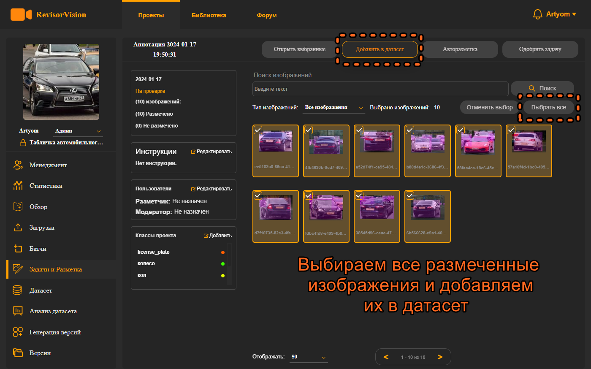
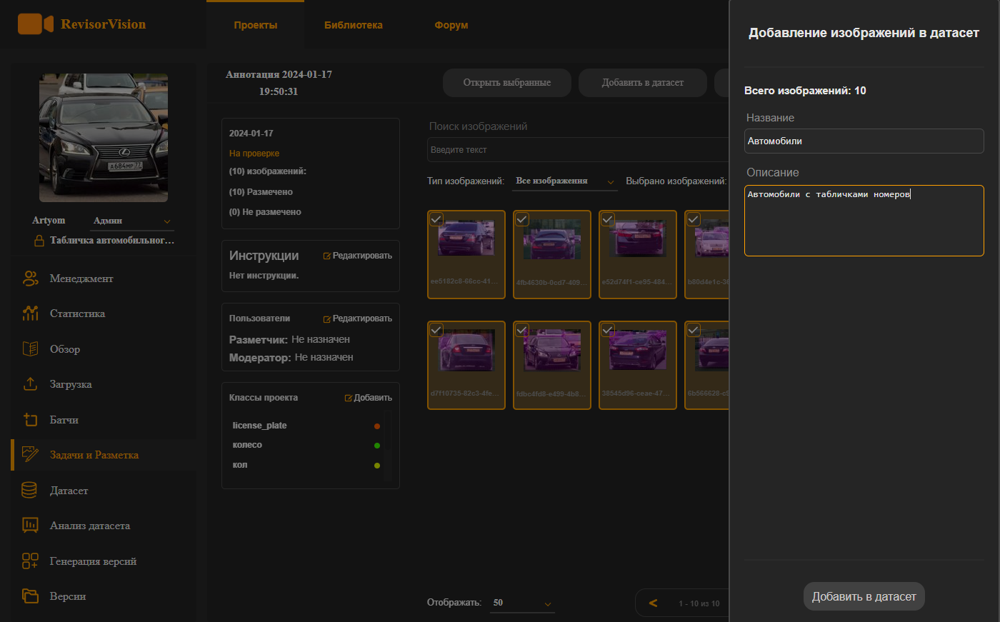
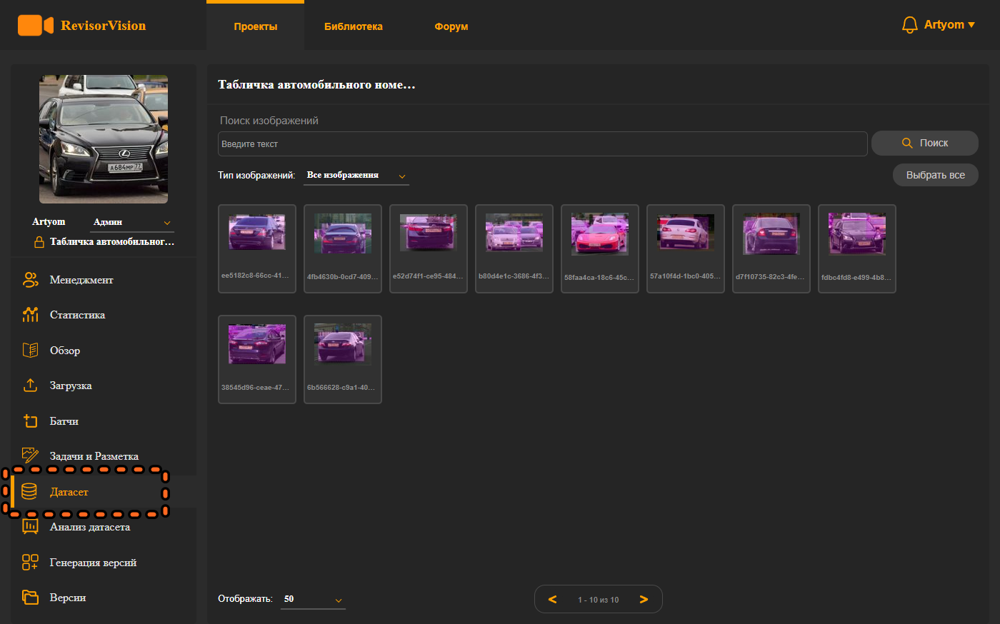
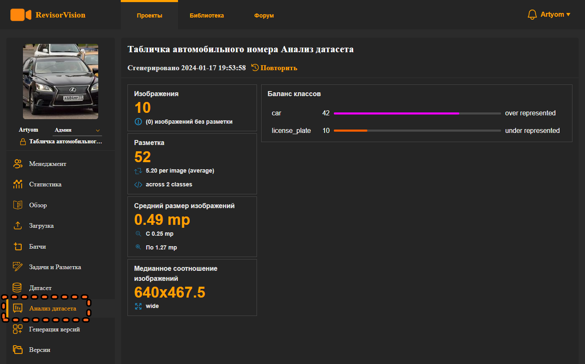
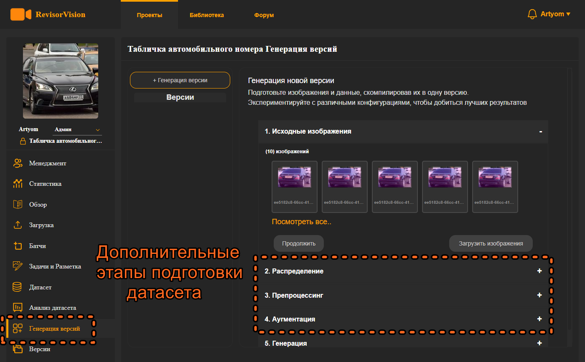
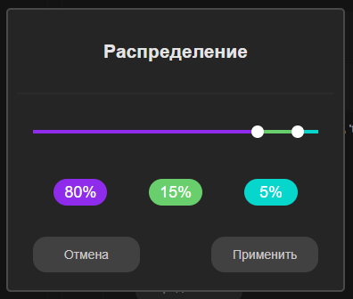
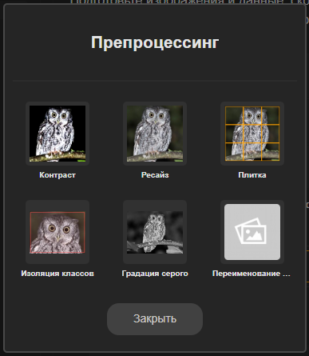
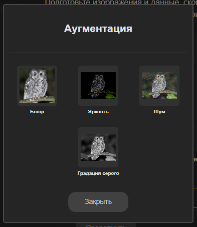
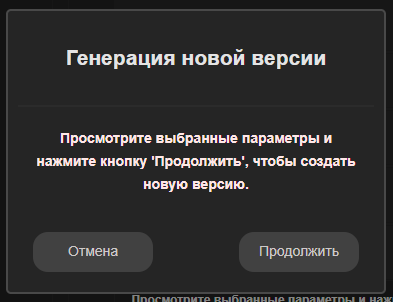

# 9. Создание версии датасета.

И так, у нас есть размеченные и подготовленные изображения. Перейдём к формированию датасета. Все размеченные изображения по разным пакетам можно добавить в один общий датасет. Для этого нужно выделить изображения (можно не выделять, тогда в датасет будут добавлены все размеченные изображения) и нажать кнопку “добавить в датасет”.

<figure><figcaption>
Рисунок 37 - Добавление изображений в датасет 
</figcaption></figure>

Нам откроется панель добавления изображений в датасет. Указываем название датасета и его описание.

<figure><figcaption>
Рисунок 38 - Создание датасета
</figcaption></figure>

Далее нас перебросит во вкладку Датасет. В ней мы можем увидеть все изображения, которые добавлены в датасет этого проекта. Здесь можно просматривать изображения и их разметку.

<figure><figcaption>
Рисунок 39 - Интерфейс датасета
</figcaption></figure>

Во вкладке анализ датасета мы можем увидеть информацию по текущему состоянию датасета. На основе неё понять каких объектов каких классов нам не хватает для баланса, сколько изображений всего и дополнительную информацию.

<figure><figcaption>
Рисунок 40 - Анализ датасета
</figcaption></figure>

И так, мы разметили нужное количество изображений и можем перейти к созданию версии датасета. Датасет – это совокупность оригинальных размеченных изображений. А на основе датасета можно создавать разные версии. Можно значительно расширить количество размеченных изображений в датасете за счёт разных методов аугментации. Или же подготовить выходные изображения нужным образом.

<figure><figcaption>
Рисунок 41 - Этапы генерации версии датасета
</figcaption></figure>

В пункте распределение нужно указать с помощью ползунков в процентном соотношении от общего количества сколько изображений пойдут в выборку для обучения, валидации и проверки. В экспортированном архиве с датасетом сервис поделит изображения по нужным папкам в заданном соотношении.

<figure><figcaption>
Рисунок 42 - Распределение Train/Valid/Test
</figcaption></figure>

Далее на этапе препроцессинга можно задать какие методы использовать для подготовки изображений. Эти методы работают с оригинальными изображениями и не добавляют новых объектов. Но например, могут увеличить количество изображений. Большие изображения сразу же можно уменьшить под нужный вход нейронной сети или же переименовать названия классов.

<figure><figcaption>
Рисунок 43 - Этап Препроцессинга
</figcaption></figure>

**Аугментация** как раз таки используется для увеличения количества изображений. Это увеличение происходит за счёт добавления разных методов изменения значений пикселей (изменение яркости, добавление шума и т.д.). Все эти методы можно смешивать и указывать им вероятность применения. За счёт применения разных случайных комбинаций методов можно значительно увеличить размер датасета. Но нужно подбирать методы отталкиваясь от специфики задачи. Нет универсальной оптимальной комбинации, и очень большое преобладание искусственных данных может только навредить при обучении модели.

<figure><figcaption>
Рисунок 44 - Этап Аугментации
</figcaption></figure>

Мы настроили все параметры для генерации датасета. И перешли к пункту 5 - сама генерация. Нажимаем кнопку продолжить. И отобразится всплывающее окно с уведомлением. Проверьте все настройки и нажимайте продолжить. Запуститься процесс генерации с прогрессом выполнения.

<figure><figcaption>
Рисунок 45 - Генерация версии датасета
</figcaption></figure>

